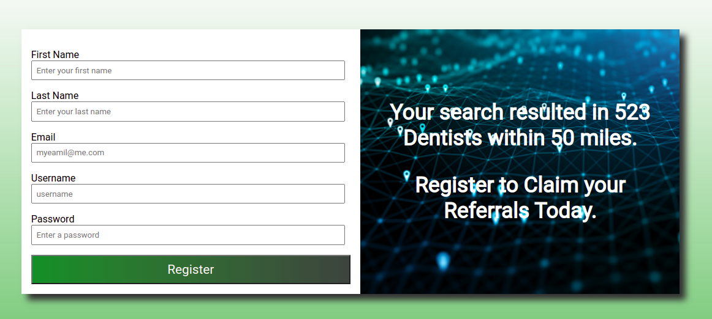

Visit xxx to give Venit a try.

## Venit

### Purpose and Flow

Venit is used to assist a marketing firm that offers custom content marketing packages to medical specialists.

These marketing packages come with a protected territory assuring the medical specialist they are exclusively marketing to medical professionals within their territory using X-Marketing's custom content.

### Searching

A user can search for referral sources within a chosen radius of the user's medical practice address by simply entering a street address, 5 digit zip code, search radius, and selecting a business type to target. 

- If any input is invalid the user is prompted for correction.

#### A successfull search results in several actions taking place:

- The MapQuest Search API is queried returning any `searchResults` that match the user input parameters.

- The Search Form data is compared against the `searchResults` for matching address and zip code. 
  - If matching data is found, it is filtered out of the search `searchResults` and placed into the database within the `prospects table`. The marketing firm now has the user's data for future campaigns. 

  - The user data saved consists of practice name, address, city, state, zip code, phone number, and date the record was created.

- An email is sent to the admin notifying that a prospect has been added to the database.

- The `searchResults` are then filtered against the database `targets table` which stores all referral sources that have been claimed by a registered customer of the marketing firm. Any records stored in the `targets table` that match the address and zip code of a `searchResult` are removed from `searchResults` resulting in a dataset containing only `eligibleResults` that can be claimed by the current user.

- If the number of `eligibleResults` is less than `n`, the user is prompted to increase their search radius.

### Registration

- If the number of `eligibleResults` is greater than `n`, the user is notified of the quantity of `eligibleResults` and presented with a registration form to claim the results and purchase the marketing package.

- The user input is validated and compared against existing clients for duplicate email or username. The user is prompted if any matching records are found or if any input is invalid.

#### Successful registration with all related data stored successfully:

  - A welcome email is sent to the new customer with an attachment in .csv containing all of their referral sources [`targets`]
  - An email notifies the admin that a user has registered for the service.
  - The user is presented with a sign-in form.

#### Successful registration with only the user's data stored in the `clients table`:

  - A welcome email is sent to the new customer.
  -  An email notifies the admin that a user has registered for the service but there was an error storing their associated referral sources [`targets`] in the `targets table`.
  - User is presented with a sign-in form.

Visit xxx to try out Venit

Task List:

- [ ] Add navBar
- [ ] Add option to contact X-marketing to assist in searching.
- [ ] Rate limiting
- [ ] Further unit testing
- [ ] Payment method via Square, Stripe
- [ ] User sign in 
- [ ] User Dashboard with ability to view, add, remove and export targets.
- [ ] Admin panel for managing prospects, clients, and associtated referral data.

Need to apply styling to registration form that matches search form and it should display properly. Probbaly best to give the same class names to the search form and resistration form children